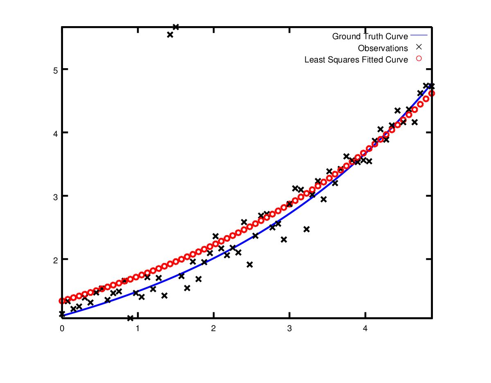

# Non-linear Least Squares非线性最小二乘

## 介绍

Ceres可以解决有约束的鲁棒非线性最小二乘问题，问题形式如下式所示

$$
\min_{x} \frac{1}{2}\sum_i\rho_i(\|f_i(x_{i_{1},...,x_{x_k}}) \|^2) \\ s.t. \quad l_j \le x_j \le u_j
$$

上述形式的问题在科学和工程领域广泛出现——从统计学中的曲线拟合（Curve Fitting）问题到计算机视觉中利用照片进行3D模型重建的任务，你都能看到非线性最小二乘问题的身影。

在本章节中，我们将学习如何使用Ceres Solver求解上述问题。本章以及后续章节里示例的完整代码可以在Ceres Solver工程下的[examples](https://github.com/ceres-solver/ceres-solver/tree/master/examples)目录中找到。

表达式中$\rho_i(\|f_i(x_{i_{1},...,x_{x_k}}) \|^2)$这部分被称作`ResidualBlock`，其中$f_i(\cdot)$叫做`CostFunction`，其具体形式由若干参数块（parameter blocks）$[x_{i_1}, \dots,x_{i_k}]$决定。在大部分优化问题中，若干个标量参数会以小组的形式出现。例如，平移向量中的3个分量以及四元数的4个分量，组成了表示相机姿态的两组参数。我们将这一组参数称为一个参数块`ParameterBlock`。当然，一个`ParameterBlock`也可以指单个参数。$l_j$和$u_j$表示参数块$x_j$的下界和上界。

$\rho_i$表示一个`LossFunction`。`LossFunction`是一个标量函数，用于在求解非线性最小二乘问题时减少离群值带来的影响。

特别的，当$\rho_i(x)=x$，即取恒等变换，且满足$l_j=-\infty$$和u_j=\infty$时，我们得到了非线性最小二乘问题[更常见的形式](https://en.wikipedia.org/wiki/Non-linear_least_squares)。

$$
\frac{1}{2}\sum\|f_i(x_{i_1},\dots,f_{i_k})\|^2
$$

## Hello World

首先，让我们考虑寻找下述函数的最小值
$$
\frac{1}{2}(10-x)^2
$$

这是一个非常简单的问题，函数在$x=10$处取得最小值，我们将用这个例子来展示如何利用Ceres求解问题。

第一步是用一个函数对象/仿函数（Functor）来表示（残差）函数$f(x)=10-x$

```c++
struct CostFunctor {
   template <typename T>
   bool operator()(const T* const x, T* residual) const {
     residual[0] = 10.0 - x[0];
     return true;
   }
};
```

需要注意，`operator`是一个模板方法，它所有输入和输出的数据类型都为模板类型`T`。之所以使用模板方法，是为了让Ceres在调用`CostFunctor::operator<T>()`时能够兼容不同的数据类型：当仅需要计算残差时，模板类型`T=double`；而当需要计算雅克比的时候，会使用一种特殊的数据类型`T=Jet`。在[Derivatives导数]()中我们会详细讨论在Ceres计算导数的多种方法。

当我们获得了计算残差函数的方法后，接下来就可以构建非线性最小二乘问题并使用Ceres求解。

```c++
int main(int argc, char** argv) {
  google::InitGoogleLogging(argv[0]);

  // 待求解变量和初始值
  double initial_x = 5.0;
  double x = initial_x;

  // 构建优化问题
  Problem problem;

  // 设置CostFunction（也就是残差），使用自动求导来计算导数（雅克比）
  CostFunction* cost_function =
      new AutoDiffCostFunction<CostFunctor, 1, 1>(new CostFunctor);
  problem.AddResidualBlock(cost_function, nullptr, &x);

  // 执行求解过程！
  Solver::Options options;
  options.linear_solver_type = ceres::DENSE_QR;
  options.minimizer_progress_to_stdout = true;
  Solver::Summary summary;
  Solve(options, &problem, &summary);

  std::cout << summary.BriefReport() << "\n";
  std::cout << "x : " << initial_x
            << " -> " << x << "\n";
  return 0;
}
```

`AutoDiffCostFunction`的输入是一个`CostFunctor`，它会对输入的函数对象自动进行求导并给出一个`CostFunction`接口。

编译并运行代码[examples/helloworld.cc](https://ceres-solver.googlesource.com/ceres-solver/+/master/examples/helloworld.cc)，结果如下

```sh
iter      cost      cost_change  |gradient|   |step|    tr_ratio  tr_radius  ls_iter  iter_time  total_time
   0  4.512500e+01    0.00e+00    9.50e+00   0.00e+00   0.00e+00  1.00e+04       0    5.33e-04    3.46e-03
   1  4.511598e-07    4.51e+01    9.50e-04   9.50e+00   1.00e+00  3.00e+04       1    5.00e-04    4.05e-03
   2  5.012552e-16    4.51e-07    3.17e-08   9.50e-04   1.00e+00  9.00e+04       1    1.60e-05    4.09e-03
Ceres Solver Report: Iterations: 2, Initial cost: 4.512500e+01, Final cost: 5.012552e-16, Termination: CONVERGENCE
x : 0.5 -> 10
```

$x$的初始值为5，两个循环后变成了10。认真的读者会发现这是一个线性问题，使用线性求解器就可以处理这个问题。默认配置里的求解器是用于求解非线性优化问题，这里为了实现简洁我们并没有修改默认选项。事实上，对于这个问题我们使用Ceres可以在一轮循环中得到答案。除此之外，我们还可以看到，求解器在第一轮优化中就让待优化值非常接近0。我们将在后续讨论关于收敛和参数设置的时候深入讨论上述现象。


注：
- 事实上求解器跑了三次迭代循环，在第三次迭代结束时，它注意到参数块的更新量非常小，因而认为结果已收敛。Ceres只会在一次迭代完全结束的时候打印结果，而会在检测到收敛的时候立即停止迭代，因此我们只能看到前两次迭代的结果（第三次迭代因收敛而终止，未打印log）。

## Derivative导数

和大多数优化库类似，Ceres通过计算目标函数任意参数、任意自变量下的函数数值和导数来求解问题。正确高效的数值计算对于求解问题至关重要。Ceres Solver提供了多种求解方式，在前面[examples/helloworld.cc](https://ceres-solver.googlesource.com/ceres-solver/+/master/examples/helloworld.cc)中已经见识到了Automatic Differentiation自动求导的表现。

现在我们来看另外两种选择，解析求导和数值求导。

### 数值求导

在某些情况下，我们无法定义一个模板函数对象，比如我们需要在计算残差时调用一个你无法查看源码的库函数。在这种情况下，可以使用数值求导。用户定义一个计算残差的函数对象，并使用它来构造一个`NumericDiffCostFunction`。举个例子，对于上面的函数$f(x)=10-x$对应的函数对象为

```c++
struct NumericDiffCostFunctor {
  bool operator()(const double* const x, double* residual) const {
    residual[0] = 10.0 - x[0];
    return true;
  }
};
```

接下来将它添加到`Problem`对象

```c++
CostFunction* cost_function = new NumericDiffCostFunction<NumericDiffCostFunctor, ceres::CENTRAL, 1, 1>(new NumericDiffCostFunctor);
problem.AddResidualBlock(cost_function, nullptr, &x);
```

对比我们在使用自动求导的时候，使用方法如下
```c++
CostFunction* cost_function =
    new AutoDiffCostFunction<CostFunctor, 1, 1>(new CostFunctor);
problem.AddResidualBlock(cost_function, nullptr, &x);
```
数值求导的Costfunctor和自动求导的看起来几乎一模一样，除了在参数类型上数值求导没有用模板参数，而是指明了用于导数计算的类型。更多细节参考`NumericDiffCostFunction`的文档。

**通常来说我们推荐使用自动求导而不是数值求导。使用模板的自动求导更为高效，而数值求导的计算代价更为昂贵，并且容易受到数值稳定性问题的影响，导致收敛更慢**

### 解析导数

在某些场景下不应该使用自动求导。比如，在一些场景中可能使用闭式解析解计算导数更加高效，这种时候不应该依赖自动求导中的链式法则。

在这些应用解析导数的场景中，可以提供自行编写的残差计算和雅克比计算的代码。为此，你需要定义一个`CostFunction`的子类，或者，如果你知道参数和残差在编译时的具体维度，你可以使用`SizedCostFunction`。这里有一个实现$f(x)=10-x$解析求导的例子`SimpleCostFunction`

```c++
class QuadraticCostFunction : public ceres::SizedCostFunction<1, 1> {
 public:
  virtual ~QuadraticCostFunction() {}
  virtual bool Evaluate(double const* const* parameters,
                        double* residuals,
                        double** jacobians) const {
    const double x = parameters[0][0];
    residuals[0] = 10 - x;

    // 如果jacobians不为空才表示需要计算雅克比
    if (jacobians != nullptr && jacobians[0] != nullptr) {
      jacobians[0][0] = -1;
    }
    return true;
  }
};
```

`SimpleCostFunction::Evaluate`的输入参数是一个叫做`parameters`的数组，输出参数包括一个表示残差的数组`residuals`和一个表示雅克比的数组`jacobians`。`jacobians`是一个可选参数，`Evaluate`函数需要检查它是否为空，如果非空，则将参数对应的导数填入其中。在这个例子中残差方程是线性的，所以雅克比是一个常数。

如你所见，实现一个`CostFunction`对象的过程有一点枯燥。我们建议除非你有不得不手动计算雅克比的需求，最好还是用`AutoDiffCostFunction`或者`NumericDiffCostFunction`来构建残差块。

### 关于导数的更多内容

计算导数是目前为止使用Ceres时最复杂的部分，在不同的场景中用户可能需要更加复杂的计算导数的方式。这一部分只是简略的说明了在Ceres中是如何使用导数的。当你可以熟练使用`NumericDiffCostFunction`和`AutoDiffCostFunction`之后，我们推荐继续了解`DynamicAutoDiffCostFunction`，`CostFunctionToFunctor`，`NumericDiffFunctor`和`ConditionedCostFunction`等计算成本函数的进阶方法。

注：
- [examples/helloworld_numeric_diff.cc.](https://ceres-solver.googlesource.com/ceres-solver/+/master/examples/helloworld_numeric_diff.cc)
- [examples/helloworld_analytic_diff.cc.](https://ceres-solver.googlesource.com/ceres-solver/+/master/examples/helloworld_analytic_diff.cc)


## Powell函数

现在来考虑一个更复杂一点的例子——最小化Powell函数的数值。另$x=[x_1, x_2, x_3, x_4]$

$$
f_1(x) = x_1 + 10 x_2 \\ f_2(x) = \sqrt{5}(x_3 - x_4) \\
f_3(x) = (x_2 - 2x_3)^2 \\ f_4(x) = \sqrt{10}(x_1 - x_4)^2
\\ F(x) = [f_1(x), f_2(x), f_3(x), f_4(x)]
$$

$F(x)$是一个拥有四个参数的函数，并有四部分残差组成。我们希望找到一个$x$使得$\frac{1}{2}\|F(x)\|^2$最小化

与之前的方法类似，第一步是定义函数对象来表示上述函数。这里给出了计算$f_4(x_1, x_4)$的代码：

```cpp
struct F4 {
  template <typename T>
  bool operator()(const T* const x1, const T* const x4, T* residual) const {
    residual[0] = sqrt(10.0) * (x1[0] - x4[0]) * (x1[0] - x4[0]);
    return true;
  }
};
```

类似的，我们可以定义类`F1`,`F2`,`F3`来计算$f_1(x_1, x_2)$ , $f_2(x_3,x_4)$以及$f_3(x_2,x_3)$。使用这些定义的类，就可以构建待求解问题


```cpp
double x1 =  3.0; double x2 = -1.0; double x3 =  0.0; double x4 = 1.0;

Problem problem;

// 构建问题时，使用自动求导来添加残差项

problem.AddResidualBlock(
  new AutoDiffCostFunction<F1, 1, 1, 1>(new F1), nullptr, &x1, &x2);
problem.AddResidualBlock(
  new AutoDiffCostFunction<F2, 1, 1, 1>(new F2), nullptr, &x3, &x4);
problem.AddResidualBlock(
  new AutoDiffCostFunction<F3, 1, 1, 1>(new F3), nullptr, &x2, &x3);
problem.AddResidualBlock(
  new AutoDiffCostFunction<F4, 1, 1, 1>(new F4), nullptr, &x1, &x4);
```

请注意每一个`ResidualBlock`只依赖两个参数而不是全部四个参数。编译程序[examples/powells.cc](https://ceres-solver.googlesource.com/ceres-solver/+/master/examples/powell.cc)可以得到输出：


```cpp
Initial x1 = 3, x2 = -1, x3 = 0, x4 = 1
iter      cost      cost_change  |gradient|   |step|    tr_ratio  tr_radius  ls_iter  iter_time  total_time
   0  1.075000e+02    0.00e+00    1.55e+02   0.00e+00   0.00e+00  1.00e+04       0    4.95e-04    2.30e-03
   1  5.036190e+00    1.02e+02    2.00e+01   2.16e+00   9.53e-01  3.00e+04       1    4.39e-05    2.40e-03
   2  3.148168e-01    4.72e+00    2.50e+00   6.23e-01   9.37e-01  9.00e+04       1    9.06e-06    2.43e-03
   3  1.967760e-02    2.95e-01    3.13e-01   3.08e-01   9.37e-01  2.70e+05       1    8.11e-06    2.45e-03
   4  1.229900e-03    1.84e-02    3.91e-02   1.54e-01   9.37e-01  8.10e+05       1    6.91e-06    2.48e-03
   5  7.687123e-05    1.15e-03    4.89e-03   7.69e-02   9.37e-01  2.43e+06       1    7.87e-06    2.50e-03
   6  4.804625e-06    7.21e-05    6.11e-04   3.85e-02   9.37e-01  7.29e+06       1    5.96e-06    2.52e-03
   7  3.003028e-07    4.50e-06    7.64e-05   1.92e-02   9.37e-01  2.19e+07       1    5.96e-06    2.55e-03
   8  1.877006e-08    2.82e-07    9.54e-06   9.62e-03   9.37e-01  6.56e+07       1    5.96e-06    2.57e-03
   9  1.173223e-09    1.76e-08    1.19e-06   4.81e-03   9.37e-01  1.97e+08       1    7.87e-06    2.60e-03
  10  7.333425e-11    1.10e-09    1.49e-07   2.40e-03   9.37e-01  5.90e+08       1    6.20e-06    2.63e-03
  11  4.584044e-12    6.88e-11    1.86e-08   1.20e-03   9.37e-01  1.77e+09       1    6.91e-06    2.65e-03
  12  2.865573e-13    4.30e-12    2.33e-09   6.02e-04   9.37e-01  5.31e+09       1    5.96e-06    2.67e-03
  13  1.791438e-14    2.69e-13    2.91e-10   3.01e-04   9.37e-01  1.59e+10       1    7.15e-06    2.69e-03

Ceres Solver v1.12.0 Solve Report
----------------------------------
                                     Original                  Reduced
Parameter blocks                            4                        4
Parameters                                  4                        4
Residual blocks                             4                        4
Residual                                    4                        4

Minimizer                        TRUST_REGION

Dense linear algebra library            EIGEN
Trust region strategy     LEVENBERG_MARQUARDT

                                        Given                     Used
Linear solver                        DENSE_QR                 DENSE_QR
Threads                                     1                        1
Linear solver threads                       1                        1

Cost:
Initial                          1.075000e+02
Final                            1.791438e-14
Change                           1.075000e+02

Minimizer iterations                       14
Successful steps                           14
Unsuccessful steps                          0

Time (in seconds):
Preprocessor                            0.002

  Residual evaluation                   0.000
  Jacobian evaluation                   0.000
  Linear solver                         0.000
Minimizer                               0.001

Postprocessor                           0.000
Total                                   0.005

Termination:                      CONVERGENCE (Gradient tolerance reached. Gradient max norm: 3.642190e-11 <= 1.000000e-10)

Final x1 = 0.000292189, x2 = -2.92189e-05, x3 = 4.79511e-05, x4 = 4.79511e-05

```

很容易可以看到该问题的解为$x_1 = 0, x_2 = 0 x_3 = 0, x_4 = 0$时目标函数取得最小值0。经过十轮迭代，ceres找到了目标函数的解为$4*10^{-12}$


## 曲线拟合

目前我们看到的优化问题都是没有数据的。最小二乘和非线性最小二乘的研究最早是为了求解曲线拟合的问题。让我们来看这样一个问题。现在有一些通过采样曲线$y = e^{0.3x+0.1}$和添加标准差为$\sigma=0.2$的高斯噪声生成的数据。现在尝试利用这些数据拟合曲线

$$y= e^{mx+c}$$

首先类定义一个模板类来计算残差。对每一个观测都会有一项残差。

```cpp
struct ExponentialResidual {
  ExponentialResidual(double x, double y) 
    :x_(x), y_(y) {}
  template<typename T>
  bool operator()(const T* const m, const T* const c, T* residual) const {
    residual[0] = y_ - exp(m[0] * x_ + c[0]);
    return true;
  }

  private:
  // 观测数据
  double x_;
  double y_;
};

```

假设观测数据叫做`data`，是一个大小为$2n$的数组，那么构建待优化问题的过程就是为每一个观测样本生成一个`CostFunction`:

```cpp
double m = 0.0;
double c = 0.0;

Problem problem;

for(int i=0; i < kNumObservations; ++i) {
  CostFunction* cost_function = 
    new AutoDiffCostFunction<ExponentialResidual, 1, 1, 1> (
      new ExponentialResidual(data[2*i], data[2*i+1]));
  problem.AddResidualBlock(cost_function, nullptr, &m, &c);
}

```

编译并运行代码[examples/curve_fitting.cc](https://ceres-solver.googlesource.com/ceres-solver/+/master/examples/curve_fitting.cc)可以得到输出:

```cpp
iter      cost      cost_change  |gradient|   |step|    tr_ratio  tr_radius  ls_iter  iter_time  total_time
   0  1.211734e+02    0.00e+00    3.61e+02   0.00e+00   0.00e+00  1.00e+04       0    5.34e-04    2.56e-03
   1  1.211734e+02   -2.21e+03    0.00e+00   7.52e-01  -1.87e+01  5.00e+03       1    4.29e-05    3.25e-03
   2  1.211734e+02   -2.21e+03    0.00e+00   7.51e-01  -1.86e+01  1.25e+03       1    1.10e-05    3.28e-03
   3  1.211734e+02   -2.19e+03    0.00e+00   7.48e-01  -1.85e+01  1.56e+02       1    1.41e-05    3.31e-03
   4  1.211734e+02   -2.02e+03    0.00e+00   7.22e-01  -1.70e+01  9.77e+00       1    1.00e-05    3.34e-03
   5  1.211734e+02   -7.34e+02    0.00e+00   5.78e-01  -6.32e+00  3.05e-01       1    1.00e-05    3.36e-03
   6  3.306595e+01    8.81e+01    4.10e+02   3.18e-01   1.37e+00  9.16e-01       1    2.79e-05    3.41e-03
   7  6.426770e+00    2.66e+01    1.81e+02   1.29e-01   1.10e+00  2.75e+00       1    2.10e-05    3.45e-03
   8  3.344546e+00    3.08e+00    5.51e+01   3.05e-02   1.03e+00  8.24e+00       1    2.10e-05    3.48e-03
   9  1.987485e+00    1.36e+00    2.33e+01   8.87e-02   9.94e-01  2.47e+01       1    2.10e-05    3.52e-03
  10  1.211585e+00    7.76e-01    8.22e+00   1.05e-01   9.89e-01  7.42e+01       1    2.10e-05    3.56e-03
  11  1.063265e+00    1.48e-01    1.44e+00   6.06e-02   9.97e-01  2.22e+02       1    2.60e-05    3.61e-03
  12  1.056795e+00    6.47e-03    1.18e-01   1.47e-02   1.00e+00  6.67e+02       1    2.10e-05    3.64e-03
  13  1.056751e+00    4.39e-05    3.79e-03   1.28e-03   1.00e+00  2.00e+03       1    2.10e-05    3.68e-03
Ceres Solver Report: Iterations: 13, Initial cost: 1.211734e+02, Final cost: 1.056751e+00, Termination: CONVERGENCE
Initial m: 0 c: 0
```

初始参数数值$m=0$,$c=0$对应目标函数的数值为121.173，ceres最终得到的参数为$m=0.291861$,$c=0.131439$，对应目标函数的数值为1.05675。这些数值和原模型中的$m=0.3$,$c=0.1$有些许差别，这是可以预见的。当利用含有噪声的数据来拟合曲线的时候，我们已预料到了这种情况。事实上，如果用$m=0.3,c=0.1$代入模型来计算目标函数，我们反而会得到更差的结果1.082425。

下图展示了这一结果。


## 鲁棒曲线拟合

现在假设数据中有一些离群点，比如一些点不符合噪声模型。如果使用上面的代码来拟合函数，会获得下图中的拟合结果



为了处理这些离群点，一种标准做法是使用`LossFunction`。LossFunction能够减小数值巨大的残差带来的影响，这些数值巨大的残差块通常对应离群点。为了将LossFunction和残差块结合在一起，我们将

```cpp
problem.AddResidualBlock(cost_function, nullptr, &m, &c);
```

转换为


```cpp
problem.AddResidualBlock(cost_function, new CauchyLoss(0.5), &m, &c);
```

`CauchyLoss`是CeresSolver自带的LossFunction之一。参数0.5指定了它的尺度。使用LossFunction之后，我们得到了如下的结果。可以看到拟合后的曲线和曲线真值更为接近了。


## 集束调整

设计Ceres的最主要的一个原因是求解大规模的集束调整问题。

给定一系列的图像特征的位置和对应关系，集束调整的目标是寻找3D点的坐标和相机参数来最小化重投影误差。该优化问题通常建模为最小二乘问题，残差为观测值与对应3D点在相机平面投影值的差的L2范数的平方。Ceres非常适合求解集束调整问题。


